# NetSanctum Architecture

Reference diagrams for the current tree. Generated by reading the committed sources; every
relationship below is traceable to a module manifest (`app/modules/**/module.py`), `app/core/**`,
`docker-compose.yml`, or `Dockerfile`.

## Scope

Only modules tracked in git appear here. Excluded on purpose:

| Excluded | Reason |
| --- | --- |
| `app/modules/torrent/` | listed in `.gitignore` |
| `app/modules/pianoboost/` | listed in `.gitignore` |
| `app/modules/private_gallery/` | not tracked; contains only `__pycache__` |

Fourteen modules are in git, and all fourteen appear in the committed `module-build.json`
catalog. Ten of them are in `default_modules`; `auth`, `settings`, and `sharing` are `required`;
`miku` is explicitly opt-in (`default_enabled=False`).

---

## 1. Module map (the whole system in one picture)

The trust rule the whole codebase is built around: **core owns infrastructure, modules own
product behavior, and modules never import each other's internals.** Everything crossing a module
boundary goes through the integration registry or the share framework.

```mermaid
flowchart TB
    Browser["Owner browser<br/>Jinja + HTMX, WebSocket for live rooms"]

    subgraph Core["app/core - infrastructure only"]
        direction TB
        Main["app/main.py<br/>FastAPI entrypoint, lifespan"]
        Reg["modules.py<br/>ModuleRegistry: discover, validate,<br/>mount, activate, diagnostics"]
        MT["module_types.py<br/>ModuleSpec, IntegrationSpec,<br/>ShareSpec, BrowserPolicySpec"]
        Regs["integrations_router<br/>/api/integrations"]
        Share["sharing router<br/>/s/{id}, deny-by-default"]
        Br["browser_router<br/>/api/browser-runtime"]
        Ag["agent_router<br/>/internal/agent"]
        Pkg["packages_router<br/>/api/packages - NSP"]
        Infra["database, storage, crypto,<br/>staging, state_store, realtime,<br/>observability, scheduler"]
    end

    subgraph Sys["System modules - always installed"]
        Auth["auth<br/>required<br/>owner token, Redis session"]
        Set["settings<br/>required<br/>typed + secret settings"]
        Store["storage<br/>usage, cleanup,<br/>package_resolver"]
    end

    subgraph Prod["Product modules"]
        direction LR
        AllLib["alllib<br/>novels, manga, anime"]
        Music["music<br/>audio, playlists, player"]
        VA["video_archiver<br/>video, subtitles, comments"]
        YT["youtube<br/>browse, isolated login"]
        Vault["vault<br/>notes, bookmarks, media"]
        Plan["planner<br/>tasks, events, reminders"]
        Search["search<br/>private cross-module index"]
        TT["tabletop_games<br/>token-scoped live rooms"]
        CC["computercraft<br/>NetSanctumOS client"]
    end

    subgraph Opt["Opt-in module"]
        Miku["miku - default_enabled false<br/>assistant + orchestrator"]
    end

    subgraph Sidecars["Isolated sidecars - separate network segments"]
        AR["agent-runtime<br/>cascade executor<br/>no DB, no keys"]
        BR["browser-runtime<br/>Chromium + Xvfb"]
        BP["browser-proxy<br/>domain-restricted egress"]
        LLM["miku-llm<br/>llama.cpp, profile miku-local"]
        Voice["miku-stt / miku-tts<br/>profile voice"]
        POT["youtube-pot<br/>bgutil PO token provider"]
    end

    subgraph Data["State"]
        PG[("PostgreSQL 16")]
        Redis[("Redis<br/>broker, db0 + results db1")]
        RState[("redis-state<br/>ephemeral, no AOF")]
        Vol[("storage/ volume<br/>sealed + plaintext objects")]
        Key[("encryption_key volume<br/>file.key - losing it loses data")]
    end

    Browser --> Main
    Browser <-->|"WebSocket"| TT
    Main --> Reg
    Main --> Regs
    Main --> Share
    Main --> Br
    Main --> Ag
    Main --> Pkg
    Reg --> MT
    Reg --> Infra
    Reg -.->|"include_router per active module"| Prod
    Reg -.-> Sys

    Regs <-.->|"invoke, validated"| Prod
    Share <-.->|"provider handlers"| Prod
    Ag <-.->|"catalog + invoke"| Prod
    CC -.->|"library.viewer.v1"| Prod
    Pkg <-.->|"package_resolver"| Prod

    Main <-->|"agent_client"| AR
    Br --> BR
    BR --> BP
    YT -.->|"BrowserPolicySpec"| Br
    AR --> LLM
    AR --> Voice
    Miku -->|"agent_client"| AR
    VA -->|"YOUTUBE_POT_PROVIDER_URL"| POT
    YT --> POT

    Main <--> PG
    Main <--> Redis
    WORKER["worker - celery"] <--> PG
    WORKER <--> Redis
    Infra <--> Vol
    Infra --> Key
    Main -.->|"unlock sessions"| RState
    WORKER -.->|"handoffs"| RState
    MIGRATE["migrate - one shot"] --> PG
```

---

## 2. Runtime topology (compose)

Every service runs the same image but with a different process role and a different set of
networks. The role is read from `NETSANCTUM_PROCESS_ROLE` by `app/core/observability.py`.

```mermaid
flowchart TB
    subgraph surfaces["Reachable surfaces"]
        Host["127.0.0.1:HOST_PORT<br/>default 8000"]
    end

    subgraph nets["Compose networks - segmentation is the isolation"]
        DEF["default - only web + worker<br/>have an egress route"]
        BACK["backend - internal"]
        MED["media-control"]
        BCTRL["browser-control - internal"]
        BPROX["browser-proxy - internal"]
        ACTRL["agent-control - internal"]
        MCTRL["model-control - internal"]
        AEGR["agent-egress"]
        BEGR["browser-egress"]
        VEGR["voice-egress"]
    end

    subgraph core["netsanctum app image"]
        WEB["web<br/>role=web<br/>validate_runtime_security then uvicorn"]
        WRK["worker<br/>role=worker<br/>celery, concurrency 2,<br/>stop_grace_period 10m"]
        MIG["migrate<br/>role=migrate, exits 0"]
        SINIT["storage-init<br/>key + ownership, exits 0"]
    end

    subgraph pg["backend"]
        PGS[("postgres:16-alpine<br/>volume pg_data")]
        RDS[("redis<br/>AOF yes, save off<br/>volume redis_data")]
        RST[("redis-state<br/>no AOF, no volume,<br/>read_only + tmpfs")]
    end

    MIG --> BACK
    SINIT -.->|"runs before everything,<br/>network_mode none"| COREALL["every other core service"]

    subgraph browser["profile: browser"]
        BRW["browser-runtime<br/>app.core.browser_worker:app<br/>seccomp profile, mem 1g,<br/>BROWSER_PROXY_URL"]
        BPR["browser-proxy<br/>app.core.browser_egress_proxy<br/>BROWSER_EGRESS_HOSTS allowlist"]
    end

    subgraph agent["profile: agent"]
        ART["agent-runtime<br/>app.core.agent_runtime:app<br/>NETSANCTUM_LOAD_DOTENV=0"]
    end

    subgraph model["profiles: miku-local / voice"]
        MINIT["model-init - one shot"]
        MLLM["miku-llm - llama.cpp<br/>q8_0 KV cache, --fit on"]
        VINIT["voice-init - one shot"]
        MSTT["miku-stt - whisper.cpp"]
        MTTS["miku-tts - silero + kokoro"]
    end

    subgraph media["media-control"]
        POT["youtube-pot - deno<br/>proof-of-origin tokens"]
    end

    Host --> WEB
    WEB --> DEF
    WEB --> BACK
    WEB --> MED
    WEB --> BCTRL
    WEB --> ACTRL
    WRK --> DEF
    WRK --> BACK
    WRK --> MED

    MIG --> BACK

    BACK --> PGS
    BACK --> RDS
    BACK --> RST
    MEDIA_NET["MEDIA_CONTROL"] --> POT

    BCTRL --> BRW
    BPROX --> BRW
    BEGR --> BPR
    ACTRL --> ART
    AEGR --> ART
    MCTRL --> ART
    ART --> MCTRL

    MCTRL --> MLLM
    MCTRL --> MSTT
    MCTRL --> MTTS
    VEGR --> MTTS
    MINIT -.-> MLLM
    VINIT -.-> MSTT
```

### Deployment invariants worth knowing

- `web` and `worker` set `STAGING_REQUIRE_TMPFS=1` and `VAULT_STATE_REQUIRE_EPHEMERAL=1`. Both
  refuse to start rather than silently write plaintext or snapshot a data key to disk
  (`app/core/staging.py`, `app/core/state_store.py`).
- The Docker socket is deliberately not mounted; container restarts stay an explicit operator
  action.
- The plain `Dockerfile` `CMD` runs migrations then uvicorn, but compose overrides it with a
  dedicated `migrate` service so web never races the schema.
- `./start.sh` writes `.env`, generates secrets, and may rewrite `HOST_PORT`. It is not a
  read-only verification command.

---

## 3. Core infrastructure

`app/core` is the only layer every module may import. Note which routers are registered
unconditionally in `app/main.py` versus mounted per active module.

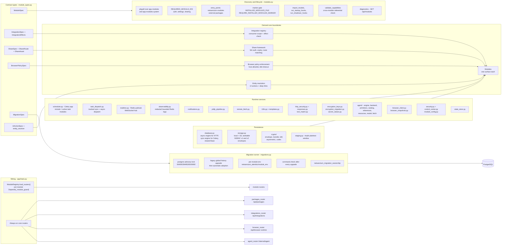

### Module activation is two independent mechanisms

This trips people up constantly, so it is worth stating explicitly.

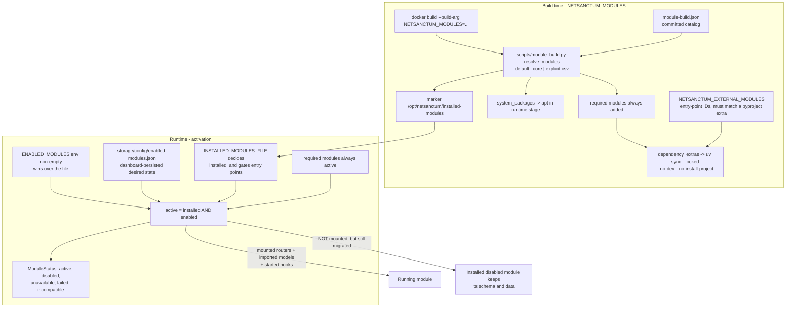

Practical consequences:

- `ENABLED_MODULES` may only narrow the installed set. Asking to enable a module that was never
  built makes it `unavailable`, not active.
- A non-empty `ENABLED_MODULES` makes `save_enabled_module_ids` raise: the dashboard refuses to
  write state the environment owns.
- The build marker is also the gate for third-party entry points. A missing marker means no
  external module is imported at all, even if the package is installed.
- `docker build ... NETSANCTUM_MODULES=core` produces an image with no optional modules and no
  `yt_dlp`, `openai`, or `requests`. CI asserts exactly that.

---

## 4. Integration graph, part 1 - content pipeline

Who calls whom, and under which contract. Consumers never import the provider's module; they
declare the integration or the contract in their manifest.

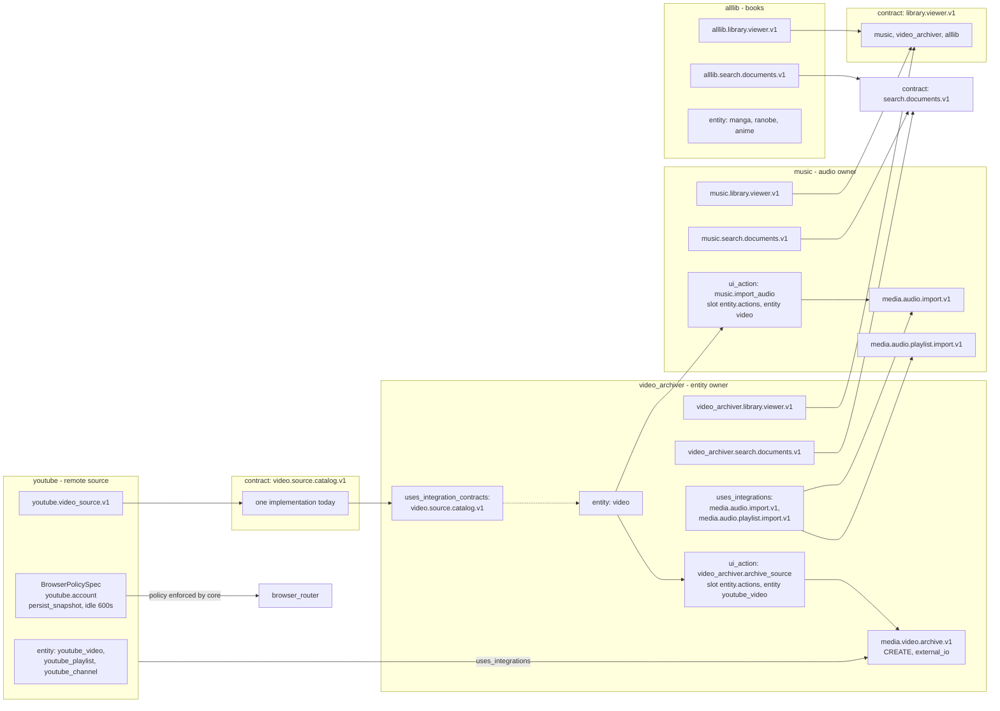

## 5. Integration graph, part 2 - search, planning, memory, undo

```mermaid
flowchart TB
    subgraph SearchMod["search - the index"]
        SG1["search.global.v1<br/>contract search.query.v1<br/>READ, idempotent<br/>global ranked search"]
        SG2["consumes search.documents.v1<br/>paginated snapshots"]
        SG3["startup + shutdown hooks<br/>rebuild and refresh loop"]
        SG4["tables: search_documents,<br/>search_sync_state,<br/>search_refresh_outbox"]
    end

    subgraph Pub["search.documents.v1 publishers"]
        P1["vault.search.documents.v1"]
        P2["music.search.documents.v1"]
        P3["video_archiver.search.documents.v1"]
        P4["alllib.search.documents.v1"]
        P5["planner.search.documents.v1"]
    end

    subgraph VaultMod["vault"]
        V1["vault.capture.v1<br/>CREATE, reversible"]
        V2["vault.undo.v1"]
        V3["vault.spaces.v1<br/>contract vault.spaces.v1"]
        V4["vault.search.documents.v1"]
        V5["share provider + sealed media"]
    end

    subgraph PlanMod["planner"]
        PL1["planner.create_task.v1"]
        PL2["planner.create_event.v1"]
        PL3["planner.complete_task.v1"]
        PL4["planner.snooze_task.v1"]
        PL5["planner.list_tasks.v1"]
        PL6["planner.list_events.v1"]
        PL7["planner.today.v1<br/>agenda, anti-nag rule"]
        PL8["planner.resolve_space.v1"]
        PL9["planner.search.documents.v1"]
        PLU["planner.undo.v1"]
    end

    subgraph MikuMod["miku - assistant"]
        MK1["miku.memory.write.v1<br/>UPDATE, reversible"]
        MK2["miku.memory.undo.v1"]
        MK3["miku.memory.search.v1"]
        MK4["miku.conversation.note.write.v1"]
        MK5["miku.conversation.note.search.v1"]
        MK6["miku.conversation.note.undo.v1"]
        MK7["memory layers: session (Redis, TTL),<br/>profile, episodic"]
    end

    subgraph CCMod["computercraft"]
        CC1["discovers every<br/>library.viewer.v1 provider"]
        CC2["entity/item resolution<br/>by module_id + item_id"]
    end

    subgraph UndoC["contract: undo.v1"]
        U1["vault, miku memory, miku notes, planner"]
    end

    P1 --> SG2
    P2 --> SG2
    P3 --> SG2
    P4 --> SG2
    P5 --> SG2
    SG2 --> SG1
    SG3 --> SG2
    SG1 --> SG4

    MK1 -->|"undo_integration"| MK2
    MK4 -->|"undo_integration"| MK6
    PL1 -->|"undo_integration"| PLU
    PL3 -->|"undo_integration"| PLU
    PL2 -->|"undo_integration"| PLU
    MK2 --> UndoC
    MK6 --> UndoC
    PLU --> UndoC
    V2 --> UndoC

    PL8 --> V3
    PL7 -->|"agenda section"| BRIEF["miku briefing"]
    PL1 --> V3

    V3 --> PL8
    V1 -->|"capture target"| MKU["miku uses_integrations"]
    SG1 --> MKU
    VAI["media.video.archive.v1"] --> MKU
    MK1 --> MK7
    MK4 --> MK7

    C2b["contract: library.viewer.v1"] --> CC1
    CC1 --> CC2
    CC2 -->|"screen, speaker"| CC3["NetSanctumOS computer"]

    V5 --> SHARE["sharing framework"]
```

### Contracts are structural, not nominal

An integration becomes a member of a contract group purely by naming the same `contract` string.
`ModuleRegistry._validate_capabilities` (`app/core/modules.py:213-243`) then requires every
provider of that contract to reference **identical** `request_model` and `result_model`. A
mismatch marks the module `failed` with "Integration contract ... schema differs from provider
...", so adding a sixth publisher means reusing `app/contracts/search_documents_v1.py` verbatim,
not a module-local variant.

`integration_providers(contract)` returns `(ModuleRecord, IntegrationSpec)` pairs, and the result
is recomputed per call from active modules only. A provider that is installed but disabled
disappears from the group without any configuration change.

### Effect policy

`IntegrationEffects` is machine-readable metadata, not a permission. Consumers are expected to
apply their own policy; the runtime refuses anything outside the per-turn catalog.

| Effect | Meaning | Available to the assistant |
| --- | --- | --- |
| `READ` | no mutation | yes |
| `CREATE` | creates state | yes, recorded with an undo plan |
| `UPDATE` | mutates existing state | no |
| `DELETE` | removes state | no |
| `EXECUTE` | runs an operation, default for unknown integrations | no |

---

## 6. Database and table ownership

Table ownership is permanent. `netsanctum_migration_ownership` records it, and reassigning a name
to a different module is a hard error, not a warning.

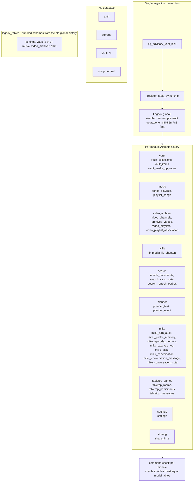

Rules encoded in `app/core/migrations.py` and `module_types.py`:

- `MigrationSpec.tables` must exactly equal the tables declared by the module's `models` module.
  A mismatch raises at migration time, listing both directions.
- A removed table name moves to `historical_tables`, which still counts as owned.
- `legacy_tables` is only for adoption of the former global history; it must be a subset of owned
  tables.
- Partial adoption is refused. If legacy tables exist but not all of them, startup fails with the
  missing names rather than silently stamping a baseline.
- Existing owned tables with no version table and no legacy marker are an error: unmanaged
  tables are never adopted.
- One Alembic `version_table` per module: `alembic_version_<module_id>`.
- Upgrades run for installed modules **including disabled ones**, so their data stays compatible.
- External modules must pass `--version-path` pointing at their writable source tree; the runner
  refuses to write a revision into an installed wheel.

---

## 7. MIKU assistant turn

The assistant is a companion and an orchestrator, not a privileged agent. It proposes; NetSanctum
validates and executes. The runtime sidecar holds no database, Redis, storage, encryption key, or
owner credential.

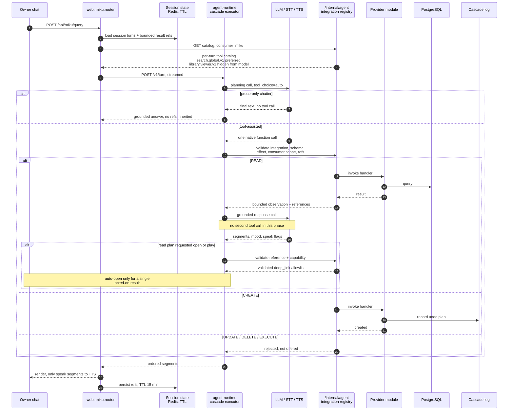

Companion memory is layered, and only the session layer may hold raw text:

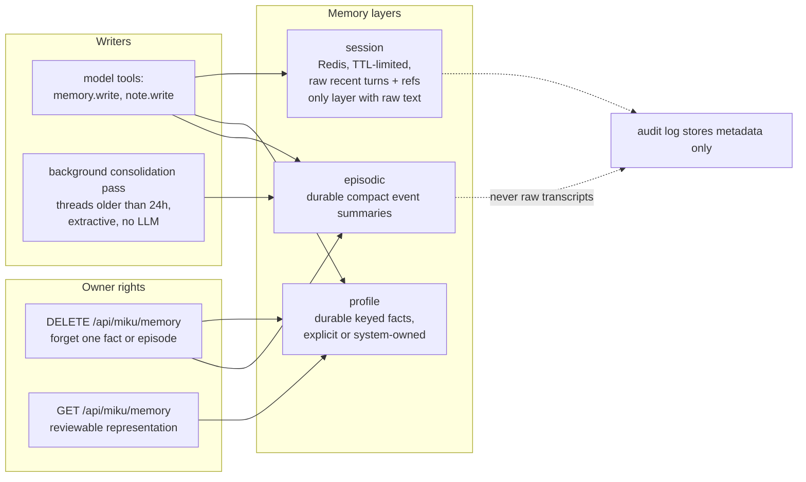

Initiative runs without Celery beat. There is no beat in this stack, so recurring passes
self-reschedule:

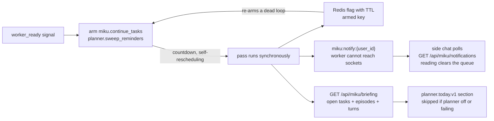

---

## 8. Media download pipeline

The same shape serves all four downloaders: video_archiver, vault, music, alllib. All of them go
through `app/core/ytdlp_pipeline.py` and write plaintext only into the tmpfs staging window.

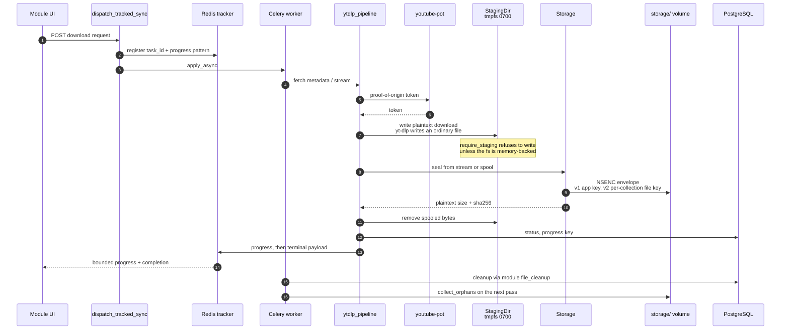

Envelope versions are distinguished by the envelope itself, never by a database column:

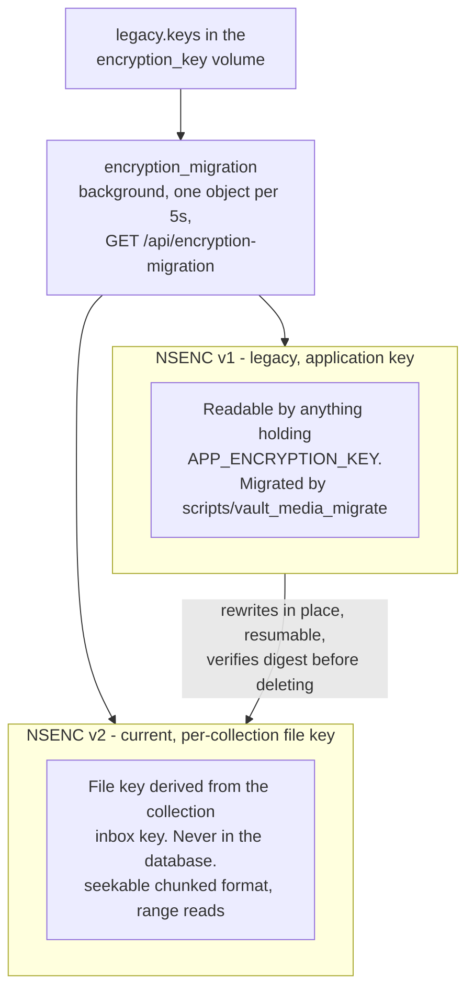

---

## 9. Public sharing

Sharing is a core framework with deny-by-default mutation policy. A provider implements only
module-specific handlers; core owns link auth, expiry, routing, and the dashboard shell.

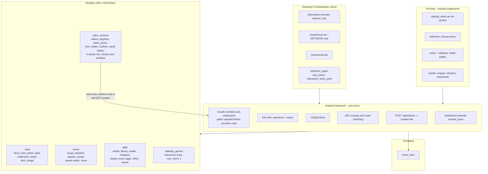

---

## 10. Offline packages (NSP)

`/api/packages` serves versioned, sealed offline bundles governed by
`OFFLINE_PACKAGE_MANIFEST_STANDARD.md`. Each module contributes resources through
`package_prefixes` plus a `package_resolver`, so core can build a bundle without knowing any
module's internals.

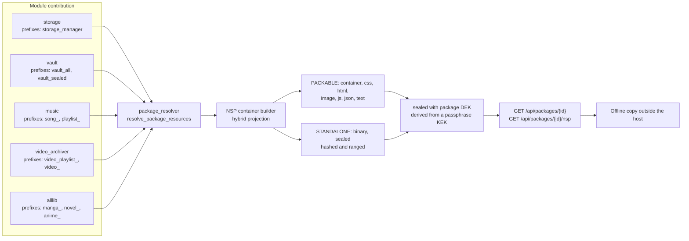

---

## 11. Storage namespaces and cleanup

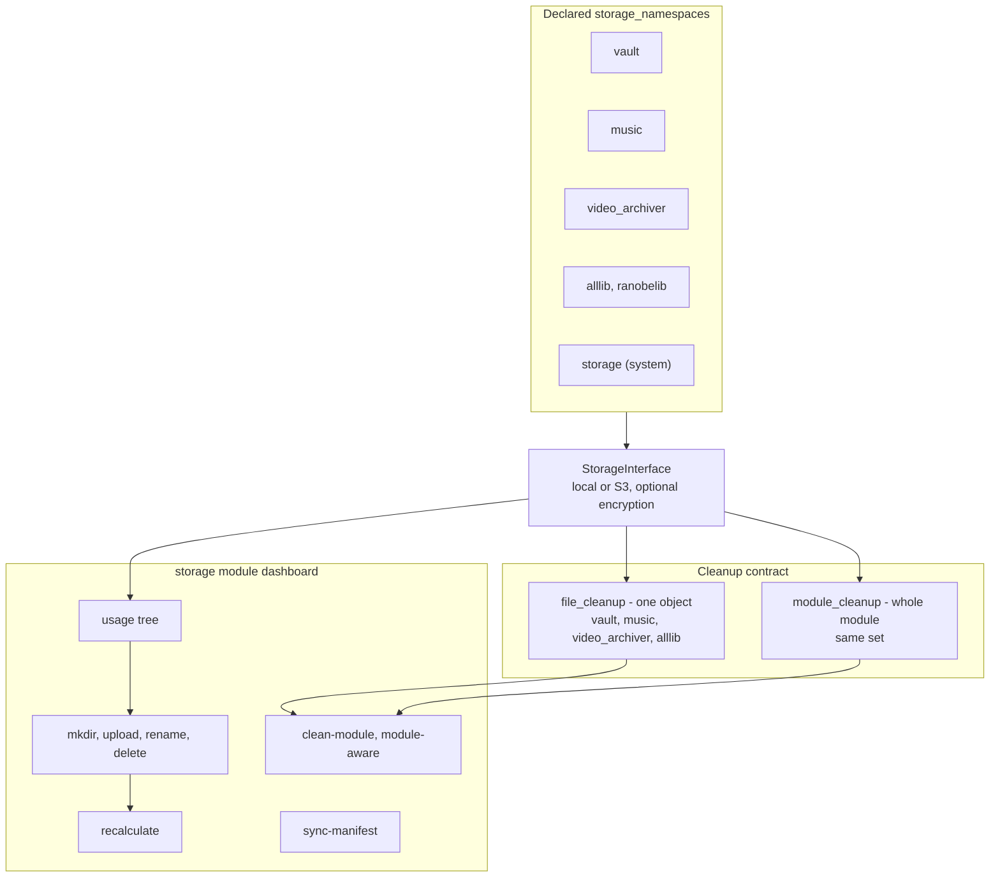

---

## 12. Frontend surface

Server-rendered Jinja plus HTMX. There is no SPA build step; the only compiled asset is the
committed Tailwind stylesheet, and a pre-commit hook plus a CI job fail if it drifts.

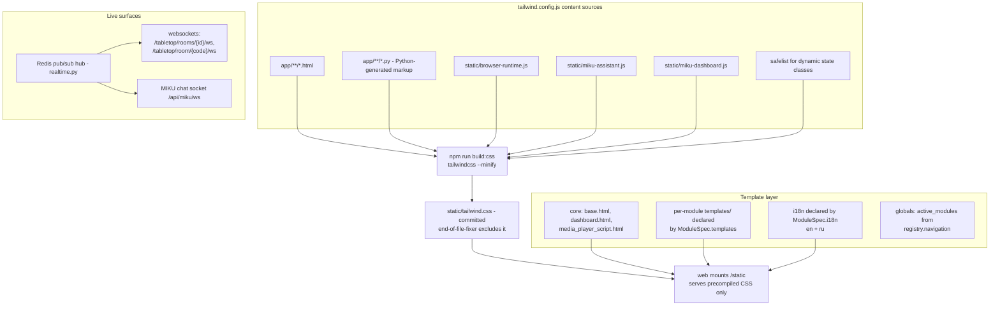

---

## Appendix A - quick reference

| Concern | Where |
| --- | --- |
| Module contract types | `app/core/module_types.py` |
| Discovery, activation, diagnostics | `app/core/modules.py` |
| Desired-state persistence | `app/core/module_config.py` |
| Build catalog | `scripts/module_build.py`, `module-build.json` |
| Integration invoke path | `app/core/integrations_router.py`, `app/core/agent_router.py` |
| Shared contract models | `app/contracts/*.py` |
| Migrations | `app/core/migrations.py`, `netsanctum_alembic/module_env` |
| Storage and envelopes | `app/core/storage.py`, `app/core/crypto/` |
| Plaintext window policy | `app/core/staging.py` |
| Ephemeral state policy | `app/core/state_store.py` |
| Assistant architecture | `app/modules/miku/ARCHITECTURE.md` |
| Offline package standard | `OFFLINE_PACKAGE_MANIFEST_STANDARD.md` |

## Appendix B - invariants an agent will otherwise break

1. Do not import another module's internals. Use `integrations`, `uses_integrations`,
   `uses_integration_contracts`, or the share provider.
2. A module's `tables` must equal its model tables exactly, or migrations refuse to run.
3. Never widen `ENABLED_MODULES` beyond the installed set; never edit `module-build.json` by hand.
4. `library.viewer.v1` stays declared in `miku` for server-side resource resolution, but must stay
   out of the model's tool catalog so discovery keeps going through `search.global.v1`.
5. Do not call `asyncio.run` inside a Celery task that touches the async engine. Use the sync
   session; the async pool hands out loop-bound connections.
6. There is no Celery beat. Recurring passes self-reschedule through Redis-armed keys.
7. After changing template classes or Python-generated markup, rebuild `static/tailwind.css`.
8. After changing a manifest's extra or system packages, run `uv lock` if dependencies changed,
   then `scripts/module_build.py catalog`.
